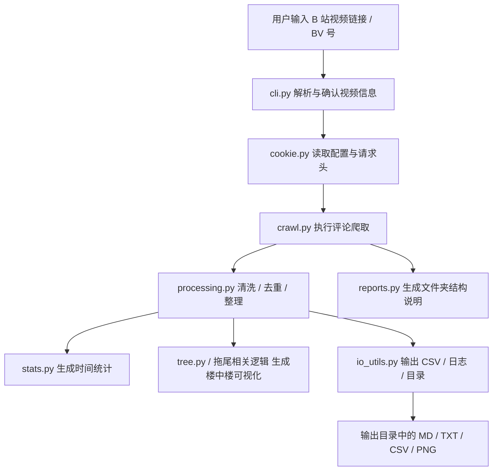

# FuckBilibiliComments 教学说明

## 项目一句话概括

这是一个面向 B 站视频评论的采集与分析工具，核心能力是根据视频 BV 号或链接抓取评论数据，支持综合爬取、测试爬取和迭代爬取，并对结果做去重、统计、整理和拖尾可视化。

## 它具体在做什么

项目会模拟正常浏览器请求，使用用户提供的 `cookie` 和 `user_agent` 去访问 B 站评论接口，从而获取视频评论、楼中楼回复、点赞数、发布时间、IP 属地等信息。采集后会把数据整理成 CSV、TXT、MD 以及统计图等文件，方便后续分析。

从 README 和代码入口可以看出，它的主要目标不是做“通用爬虫”，而是围绕 B 站视频评论这一场景做完整的数据链路：采集、清洗、去重、统计、输出、可视化。

## 运行入口

项目保留了一个薄入口 [FuckBilibiliComments.py](FuckBilibiliComments.py)，兼容直接运行 `python FuckBilibiliComments.py` 的方式。真正的主逻辑已经拆分到包目录 [FuckBilibiliComments/](FuckBilibiliComments) 里，入口只负责：

1. 检查 Python 版本
2. 自动检查和安装依赖
3. 调用主程序

核心入口在 [FuckBilibiliComments/main.py](FuckBilibiliComments/main.py)。

## 架构图



## 主要模块分工

### [FuckBilibiliComments/main.py](FuckBilibiliComments/main.py)

程序总控。它负责读取配置、获取请求头、判断运行模式、创建输出目录，并按模式调用不同的爬取与整理流程。

### [FuckBilibiliComments/cli.py](FuckBilibiliComments/cli.py)

交互式命令行界面。它会让用户输入视频链接，解析 BV 号，确认视频信息，再让用户选择三种模式：

1. 综合模式
2. 测试模式
3. 迭代模式

### [FuckBilibiliComments/cookie.py](FuckBilibiliComments/cookie.py)

管理本地 `config.json`，构造带有登录状态的请求头。这个项目能获取完整评论，关键依赖就是 cookie 模拟登录。

### [FuckBilibiliComments/crawl.py](FuckBilibiliComments/crawl.py)

负责真正的评论抓取逻辑。README 和主程序代码显示，它至少支持：

1. 热度爬取
2. 时间爬取
3. 综合模式采集
4. 迭代模式采集
5. 测试模式采集

### [FuckBilibiliComments/processing.py](FuckBilibiliComments/processing.py)

负责合并、去重、整理以及输出更规整的结果文件。综合模式下尤其重要，因为它要处理热度爬取和时间爬取两份结果的合并。

### [FuckBilibiliComments/stats.py](FuckBilibiliComments/stats.py)

负责时间统计分析。项目会按分钟、小时、日、月、年等口径生成统计结果，有些场景还会输出折线图。

### [FuckBilibiliComments/reports.py](FuckBilibiliComments/reports.py)

负责生成文件夹结构说明等文档型输出，方便用户快速理解结果目录里有哪些文件。

### [FuckBilibiliComments/io_utils.py](FuckBilibiliComments/io_utils.py)

负责输出目录、日志、文件命名、CSV 保存、清理日志等通用 I/O 工作。

### [FuckBilibiliComments/video.py](FuckBilibiliComments/video.py)

负责视频信息识别、BV 号解析、标题获取、URL 解析等前置工作。

## 输出内容

综合模式的输出目录通常会包含：

1. 原始数据 CSV
2. 去重合并后的 CSV
3. 重复评论列表
4. 统计结果 TXT
5. 文件夹结构说明 MD
6. 楼中楼拖尾整合 MD
7. 按时间统计结果与统计图
8. 日志目录

也就是说，这个项目不只是“抓数据”，还会把数据整理成适合阅读和复查的形式。

## 运行前提

根据 README，最低要求是：

1. Python 3.7 或更高版本
2. 可用的 B 站 `cookie`
3. `user_agent`
4. 常见依赖包会自动检测和安装

项目 README 提到的手动依赖安装命令是：

```bash
pip install requests>=2.25.0 pandas>=1.3.0 matplotlib>=3.3.0
```

## 典型使用流程

1. 运行 [FuckBilibiliComments.py](FuckBilibiliComments.py)
2. 首次启动时按提示配置 `cookie` 和 `user_agent`
3. 输入 B 站视频链接或 BV 号
4. 选择采集模式
5. 等待爬取完成
6. 到输出目录查看 CSV、统计文件、拖尾图和日志

## 这个项目适合什么场景

它比较适合：

1. 想研究某个视频评论舆情的人
2. 想分析热门评论和时间分布的人
3. 想整理楼中楼回复关系的人
4. 想做 B 站评论数据清洗和统计的人

## 本次对话记录

### 用户问题

“这个项目是干什么的”

### 回答结论

这是一个 B 站评论爬取与分析工具，重点功能是采集视频评论、去重整理、生成统计结果和楼中楼可视化输出。

### 依据

1. [README.md](README.md) 明确写了“B站评论爬取与分析工具”
2. [FuckBilibiliComments.py](FuckBilibiliComments.py) 只是薄入口
3. [FuckBilibiliComments/main.py](FuckBilibiliComments/main.py) 负责调度采集、整理和输出流程
4. [FuckBilibiliComments/cli.py](FuckBilibiliComments/cli.py) 提供视频输入和模式选择

## 额外提醒

这个项目依赖 cookie 访问评论接口，说明它不是纯公开数据抓取；如果 cookie 频繁使用，README 里也提到可能触发 B 站的风控或临时封禁。